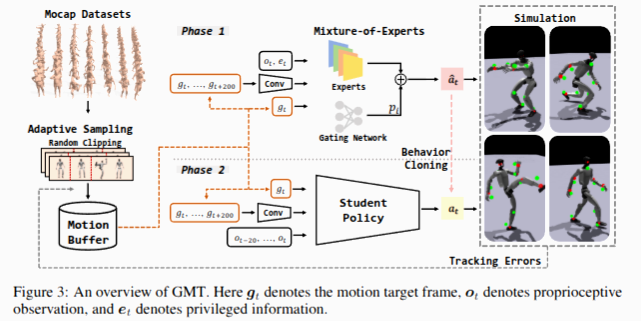

# GMT：General Motion Tracking for Humanoid Whole-Body Control

> **一句话概括：**这篇论文为了解决“大规模、多类型人体动作难以由一个统一机器人策略稳定跟踪”的问题，提出了由 **Adaptive Sampling** 和 **Motion Mixture-of-Experts** 组成的 GMT 框架，核心是将训练资源集中到困难动作，并让不同专家分别建模不同运动模式，最终在 Unitree G1 上用单一策略实现多种全身动作跟踪。

## 论文信息

* **论文：**GMT: General Motion Tracking for Humanoid Whole-Body Control
* **作者：**Zixuan Chen、Mazeyu Ji、Xuxin Cheng、Xuanbin Peng、Xue Bin Peng、Xiaolong Wang
* **会议：**IEEE/RSJ International Conference on Intelligent Robots and Systems，IROS 2026
* **预印本：**arXiv:2506.14770，2025 年 6 月首次提交，2025 年 9 月更新 v2
* **论文链接：**arXiv 论文页面
* **代码链接：**官方 GitHub 仓库
* **阅读日期：**2026 年 7 月 20 日
* **关键词：**Humanoid、Motion Tracking、Motion Imitation、Adaptive Sampling、Mixture-of-Experts、Teacher-Student、DAgger

---

## 1. 这篇论文在解决什么问题？

### 研究背景

人形机器人运动控制的一条重要技术路线，是把人体动作重定向到机器人上，再通过强化学习训练机器人跟踪这些参考动作。

当训练数据只有一两个动作时，普通 MLP 策略往往就能完成跟踪；但当动作规模扩展到数千条，且同时包括走路、跑步、下蹲、踢腿、跳舞、拳击等差异明显的技能时，希望用一个策略覆盖所有动作会变得非常困难。

GMT 的目标不是训练某一个特定技能，而是训练一个可以跟踪大量不同动作的**统一全身运动控制器**。

### 现有方法的问题

现有方法通常采用：

> 从动作数据集中采样一条参考 Motion，通过姿态、速度和关键身体位置等奖励，使用 PPO 训练一个 Motion Tracking 策略。

但当数据规模扩大后，会出现四类问题。

#### 1. 动作数据分布严重不均衡

AMASS 等大型数据集里，走路、站立和原地小动作很多，而踢腿、跳跃等困难动作很少。

使用普通均匀采样时，大部分训练样本会被简单动作占据；困难动作不仅数量少，而且策略经常在困难片段开始后迅速失败，导致真正有效的训练数据更少。

#### 2. 长 Motion 中的困难片段容易被淹没

一条长 Motion 可能包含：

```text
站立 → 走路 → 转身 → 踢腿 → 恢复站立
```

策略可能已经学会前面的站立和走路，却始终学不会中间两秒的踢腿。

如果每次仍从整段 Motion 中采样，那么大量训练时间会重复花在已经掌握的简单片段上。

#### 3. 单个 MLP 容量不足

不同动作对应不同的动力学模式。例如：

* 走路需要周期性步态；
* 高踢腿需要单脚支撑和平衡；
* 深蹲需要大幅降低质心；
* 拳击主要依赖上半身快速运动。

让一个普通 MLP 用完全相同的参数表示所有动作，容易产生参数冲突和平均化行为。

#### 4. 真实机器人存在部分可观测性

仿真中的特权策略可以获得基座线速度、全局位置等状态，但这些信息在真实机器人上通常无法准确测量。

因此，直接部署特权策略并不现实，需要进一步训练只依赖机器人可观测信息的学生策略。

### 论文目标

这篇论文希望解决的核心问题是：

> 如何从大规模、类别不均衡的 Motion 数据中，训练一个容量足够、能够覆盖多种动作，并且可以部署到真实机器人的统一 Motion Tracking 策略。

需要注意，GMT 解决的是**大规模通用 Motion Tracking**，而不是专门解决后空翻、起身或地面翻滚等极限动作。

---

## 2. 论文的核心思路

作者的关键观察是：

> 大规模 Motion Tracking 失败，不仅是奖励函数或 PPO 参数的问题，还来自训练样本分配不合理，以及单一网络容量不足。

因此，作者提出两个核心模块：

1. **Adaptive Sampling：**增加困难动作和困难片段的训练概率。
2. **Motion Mixture-of-Experts：**使用多个专家网络分别表示不同运动区域，由门控网络动态组合专家输出。

同时，GMT 使用：

* 特权教师策略；
* DAgger 学生蒸馏；
* 当前下一帧和未来约两秒的 Motion 信息；
* 数据筛选和 Sim-to-Real 随机化。

用一句更直白的话解释：

> 传统方法是让一个普通网络，从整个动作库里较平均地学习所有动作；GMT 则是让训练器主动多练不会的动作，并让多个专家分担不同类型的运动控制。

### GMT 与普通 Mimic 的关系

GMT 本质上仍然属于 **reference-based motion tracking，也就是 Mimic 路线**。

它仍然需要明确的参考 Motion，并使用参考姿态、速度和关键身体位置构造 Tracking Reward。它没有使用 AMP 中的判别器，也没有让策略只通过“像不像人类动作”来学习。

因此可以将它理解为：

```text
普通 Mimic
  + 大规模困难动作采样机制
  + 更高容量的 MoE 策略
  + 未来参考轨迹编码
  + Teacher-Student 部署体系
  = GMT
```

它不是取代 Mimic，而是在解决：

> 当 Mimic 从一两个动作扩展到数千个动作时，应该怎样采样、怎样增加模型容量、怎样完成真实部署。

### 核心贡献

1. 提出 Adaptive Sampling，根据动作掌握程度和跟踪误差，动态调整 Motion 的采样概率。
2. 提出 Motion MoE，使多个专家分别建模不同运动模式，提高统一策略的表达能力。
3. 结合未来 Motion 编码、教师—学生训练和数据筛选，在真实 Unitree G1 上实现统一的多动作跟踪策略。

其中，最重要的创新是：

> **Adaptive Sampling 和 Motion MoE 的组合：前者解决训练数据分配问题，后者解决策略容量问题。**

---

## 3. 方法介绍

### 整体流程





```text
AMASS + LAFAN1 人体动作
          ↓
规则筛选 + 初步策略筛选
          ↓
人体动作重定向到机器人
          ↓
Random Clipping
          ↓
Adaptive Sampling 选择训练片段
          ↓
PPO 训练带特权信息的 MoE Teacher
          ↓
DAgger 蒸馏 Student Policy
          ↓
MuJoCo 验证
          ↓
部署到真实 Unitree G1
```

具体流程如下：

1. 从 AMASS 和 LAFAN1 中收集人体动作。
2. 去除机器人明显无法执行的动作。
3. 将长 Motion 随机裁剪成不超过 10 秒的子片段。
4. 根据每个片段的完成情况动态调整采样概率。
5. 使用 PPO 训练能够获得特权状态的 MoE 教师策略。
6. 使用 DAgger，让学生策略模仿教师动作。
7. 将学生策略部署到真实机器人。

### 核心模块 A：Adaptive Sampling

* **输入：**所有 Motion 子片段、每个片段的完成等级、历史最大跟踪误差。
* **输出：**各个 Motion 子片段下一轮被采样的概率。
* **作用：**减少已经掌握的简单动作训练次数，增加困难动作和高误差片段的训练次数。
* **为什么需要：**普通均匀采样无法保证有限训练资源真正覆盖困难动作。

Adaptive Sampling 包含两部分。

#### Random Clipping

超过 10 秒的 Motion 会被切分为多个子片段，并在切分位置上加入随机偏移。训练过程中还会定期重新切分。

它的意义不是简单缩短 Motion，而是让一条长 Motion 中不同局部阶段都有机会成为相对独立的训练单元。

例如：

```text
原始 Motion：
站立 ─ 走路 ─ 踢腿 ─ 转身 ─ 站立

第一次裁剪：
[站立─走路] [走路─踢腿] [转身─站立]

重新裁剪：
[站立─走路─踢腿] [踢腿─转身] [转身─站立]
```

这样可以降低困难动作始终被简单前置片段淹没的问题。

#### 基于跟踪性能的采样

每个 Motion 子片段都有一个训练难度或完成等级。策略成功完成后，该片段会逐渐进入更严格的跟踪要求；已经达到最高完成等级的片段，则根据剩余最大跟踪误差决定是否继续被重点采样。

其基本形式可以写为：

$$
p_i=\frac{s_i}{\sum_j s_j}
$$

其中：

* $s_i$ 是第 $i$ 个 Motion 的采样分数；
* $p_i$ 是对应的采样概率；
* 未掌握的 Motion 根据课程等级获得较高分数；
* 已经基本掌握的 Motion 根据残余跟踪误差获得分数。

直觉上就是：

> 先保证每个动作都能完成，再集中优化那些虽然能完成、但跟踪质量仍然较差的动作。

论文实验显示，该采样机制对困难 Motion 的改善比对简单 Motion 更明显。

---

### 核心模块 B：Motion Mixture-of-Experts

* **输入：**机器人状态和目标 Motion 信息。
* **输出：**目标关节位置动作。
* **作用：**让不同专家分别学习不同运动模式。
* **为什么需要：**单个 MLP 难以同时表示大量差异显著的动作。

GMT 使用 Soft Mixture-of-Experts。假设一共有 $N$ 个专家：

$$
a_t=\sum_{i=1}^{N}p_i a_t^{(i)}
$$

其中：

* $a_t^{(i)}$ 是第 $i$ 个专家输出的动作；
* $p_i$ 是门控网络分配给第 $i$ 个专家的权重；
* $\sum_i p_i=1$；
* $a_t$ 是最终发送给执行器的目标动作。

这不是“从多个专家中硬选一个”，而是对所有专家输出进行加权组合。

论文展示了一段由站立、踢腿、后退和再次站立组成的复合动作。随着动作阶段变化，门控权重也发生明显切换，说明不同专家确实出现了一定程度的运动阶段分工。

但需要注意：

> 论文中的 MoE 主要用于训练特权教师策略；最终可部署的学生策略通过 DAgger 模仿教师，不应简单理解为真实机器人必须运行完整 MoE Teacher。

---

### 核心模块 C：未来 Motion 输入

GMT 不只给策略输入下一帧目标，还输入未来约两秒的参考 Motion。

未来序列先通过卷积编码器压缩为一个 latent，再与立即需要跟踪的下一帧目标拼接：

$$
z_t=f_{\mathrm{conv}}
\left(
g_{t+1},g_{t+2},\ldots,g_{t+H}
\right)
$$

$$
a_t=\pi\left(o_t,g_{t+1},z_t\right)
$$

其中：

* $o_t$ 是机器人当前观测；
* $g_{t+1}$ 是立即需要跟踪的下一帧；
* $z_t$ 是未来约两秒轨迹的压缩表示。

未来窗口负责告诉机器人：

> 接下来整体要做什么。

立即下一帧负责告诉机器人：

> 此刻具体应该跟到哪里。

实验表明，只输入长时间未来窗口、却不单独提供下一帧，会造成明显性能下降，说明长期趋势不能代替精确的局部目标。

---

### 核心模块 D：Teacher-Student

第一阶段使用 PPO 训练特权教师：

$$
a_t^T=\pi_T(o_t,e_t,g_t)
$$

其中 $e_t$ 表示仿真中可获得、但真实机器人难以准确获取的特权信息。

第二阶段使用 DAgger 训练学生：

$$
\mathcal L_{\mathrm{student}}
=

\left|
\pi_S(h_t,g_t)-a_t ^T
\right|_2^2
$$

其中 $h_t$ 可以包含学生可获得的观测历史。

Teacher-Student 的核心作用是：

> 教师负责利用完整状态找到高质量控制行为，学生负责把这些行为压缩为真实机器人可以执行的策略。

因此，GMT 和你当前“先训练带特权信息的 Teacher，再导出 Motion 或训练非特权 Student”的总体思路是一致的。

---

## 4. 实验与结果

### 实验设置

* **训练数据：**经过筛选的 AMASS 与 LAFAN1。
* **数据规模：**8,925 个 Motion clips，总时长约 33.12 小时。
* **仿真器：**Isaac Gym。
* **并行环境：**4,096。
* **训练规模：**每个策略约使用 68 亿个仿真样本。
* **机器人：**Unitree G1。
* **主要 Baseline：**重新实现并在相同数据上训练的 ExBody2。
* **评价指标：**

  * MPKPE：关键身体位置误差；
  * MPJPE：关节位置误差；
  * 线速度误差；
  * 偏航角速度误差。

### 主要结果

以下为最关键的 MPKPE 结果，数值越低越好：

| 方法                     | AMASS-Test MPKPE / mm | LAFAN1 MPKPE / mm |
| ---------------------- | --------------------: | ----------------: |
| ExBody2                |                 50.28 |             58.36 |
| GMT Student            |                 43.01 |             46.14 |
| GMT Privileged Teacher |             **42.07** |         **45.16** |

与 ExBody2 相比，GMT Teacher 的 MPKPE：

* 在 AMASS-Test 上降低约 **16.3%**；
* 在 LAFAN1 上降低约 **22.6%**。

学生策略的结果与特权教师非常接近，说明 Teacher-Student 蒸馏没有造成严重的性能损失。

论文还在真实 G1 上展示了：

* 风格化走路；
* 高踢腿；
* 跳舞和旋转；
* 蹲走；
* 踢球；
* 拳击、跑步和侧向移动。

此外，GMT 还能在 MuJoCo 的 Sim-to-Sim 实验中跟踪由 MDM 文本生成模型产生的新 Motion。

### 消融实验

#### Adaptive Sampling 和 MoE

| 方法                   | AMASS MPKPE | LAFAN1 MPKPE |
| -------------------- | ----------: | -----------: |
| 去掉 MoE               |       43.54 |        48.26 |
| 去掉 Adaptive Sampling |       42.53 |        49.61 |
| 两者都去掉                |       44.34 |        52.34 |
| 完整 GMT               |   **42.07** |    **45.16** |

可以看出：

* MoE 和 Adaptive Sampling 都有独立贡献；
* 同时去掉两者时性能最差；
* Adaptive Sampling 在 LAFAN1 上的影响尤其明显；
* 两个模块对于高难度 Motion 的改善比平均指标表现出的幅度更大。

#### Motion 输入窗口

| Motion 输入      | AMASS MPKPE | LAFAN1 MPKPE |
| -------------- | ----------: | -----------: |
| 仅下一帧           |       46.02 |        51.16 |
| 下一帧 + 0.5 秒未来  |       43.64 |        49.87 |
| 下一帧 + 1 秒未来    |       43.15 |        47.41 |
| 下一帧 + 2 秒未来    |   **42.07** |    **45.16** |
| 仅 2 秒未来、不提供下一帧 |       49.52 |        61.24 |

该实验说明：

1. 更长的未来信息有助于提前准备动作。
2. 立即下一帧依然不可替代。
3. 最有效的结构是“近期精确目标 + 长期趋势信息”，而不是只选择其中一种。

---

## 5. 优点和局限

### 优点

#### 1. 解决的是具有实际价值的系统性问题

GMT 没有只提出一个新的奖励项，而是同时处理：

* 数据分布；
* 采样效率；
* 模型容量；
* 时间信息；
* 部分可观测性；
* Sim-to-Real。

这使它更像一套完整的大规模 Motion Tracking 训练方案。

#### 2. Adaptive Sampling 非常实用

很多多 Motion 训练问题并不是完全学不会，而是困难动作获得的有效训练样本太少。

GMT 将长动作切分、重新切分，并根据完成程度调整采样概率，直接针对了这一问题。相比继续盲目调 PPO 参数，这种方法更容易解释，也更容易迁移到其他 Mimic 系统。

#### 3. MoE 与任务结构相匹配

人体动作天然存在不同运动模式。用多个专家分别表示步态、踢腿、下蹲等区域，比单纯把 MLP 加宽更符合问题结构。

#### 4. 消融实验比较完整

论文分别验证了：

* Adaptive Sampling；
* MoE；
* 二者组合；
* 不同未来窗口；
* 下一帧输入的重要性；
* Teacher 与 Student 的性能差距。

因此，能够比较清楚地判断性能究竟来自哪些设计。

#### 5. 完成了真实机器人部署

论文不仅报告仿真误差，也展示了多种技能在真实 Unitree G1 上的执行效果，这增强了方法的工程可信度。

### 局限

#### 1. “General”建立在大量数据筛选之上

GMT 会主动删除：

* 爬行；
* 倒地状态；
* 极端动态动作；
* 初步策略无法完成的动作。

论文甚至明确将 back-flipping 和 rolling 作为机器人硬件可能无法完成的动作示例。

因此，这里的 General 更准确的含义是：

> 在经过筛选的、机器人可执行的动作分布内实现统一跟踪。

而不是：

> 任意人体 Motion 都可以由一个策略学会。

#### 2. 对高动态空翻没有直接验证

论文展示的困难动作主要是高踢腿、旋转、跑步、拳击等，缺少空翻、落地恢复等具有完整腾空阶段的技能。

#### 3. 缺乏接触丰富的地面技能

作者明确指出，当前系统不支持倒地起身和地面翻滚等 Contact-Rich Skills，也没有针对复杂接触行为进行专门建模。

#### 4. 没有复杂地形能力

GMT 没有输入地形观测，也没有针对斜坡和楼梯进行训练。因此，它的 General Motion Tracking 主要建立在平坦地面条件下。

#### 5. Baseline 范围较窄

定量对比主要集中在作者重新实现的 ExBody2，而且 Baseline 和消融实验主要评估特权教师策略。

真实机器人部分主要是视频展示，缺少按动作类别划分的成功率、摔倒率和长期稳定性统计。

#### 6. MoE 的专家分析还不充分

论文展示了门控权重随动作阶段变化，但没有深入报告：

* 每个专家的长期负载；
* 是否发生专家坍缩；
* 不同专家真正学习了什么；
* 专家数量变化对结果的影响；
* MoE 是否优于同等计算量的其他高容量结构。

因此，现有结果能说明 MoE 有效，但还不能完全解释其内部机制。

#### 7. 开源完整度有限

截至当前，官方仓库主要提供 MuJoCo Sim-to-Sim 脚本、预训练模型和少量示例 Motion。仓库仍注明数据处理和重定向代码将后续发布，完整训练管线的复现条件有限。

---
## 7. 总结

这篇论文解决了：

> 如何从大规模、分布不均衡的 Motion 数据中，训练一个能够部署到真实人形机器人的统一全身运动跟踪策略。

核心方法是：

> 使用 Adaptive Sampling 集中训练困难动作，使用 Motion MoE 提高策略容量，并结合未来 Motion 输入和 Teacher-Student 蒸馏完成真实部署。

它能够有效工作的原因是：

> 它没有让所有动作共享完全相同的训练资源和模型表示，而是根据动作难度动态分配训练样本，并允许不同专家承担不同运动模式。